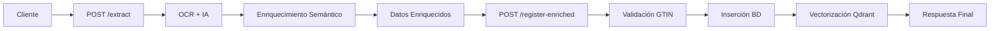

# 📝 Contrato de API - Extracción y Registro de Medicamentos

## 📋 Información General

| Campo | Valor |
|-------|-------|
| **Endpoints** | `POST /api/medication/extract`<br/>`POST /api/medication/register-enriched` |
| **Versión** | 1.0.0 |
| **Protocolo** | HTTP/HTTPS |
| **Formato** | JSON / Multipart |
| **Codificación** | UTF-8 |
| **Puerto desarrollo** | 9088 |

## 🎯 Propósito

Esta API proporciona un **flujo completo** para extraer información de medicamentos desde imágenes usando IA y registrarlos en la base de datos GTIN:

### 🔍 **Paso 1: Extracción** (`/extract`)
- Procesamiento de imágenes con OCR (Mistral/Gemini)
- Enriquecimiento semántico con Qdrant
- Estructuración de datos de medicamentos

### 📝 **Paso 2: Registro** (`/register-enriched`)
- Registro en base de datos GTIN
- Marcado como generado por IA
- Vectorización automática para futuras búsquedas

## 🔍 Flujo de Proceso Completo



# 🔍 ENDPOINT 1: EXTRACCIÓN DE MEDICAMENTOS

## 📊 Endpoint: POST /api/medication/extract

### Headers Requeridos
```http
Content-Type: multipart/form-data
Accept: application/json
```

### Parámetros de Query

| Parámetro | Tipo | Requerido | Descripción | Valores |
|-----------|------|-----------|-------------|---------|
| `provider` | string | No | Proveedor OCR a utilizar | `"mistral"`, `"gemini"` |

### Cuerpo del Request (Multipart)

```bash
# Ejemplo con cURL
curl -X POST "http://localhost:9088/api/medication/extract?provider=gemini" \
  -F "files=@medicamento1.jpg" \
  -F "files=@medicamento2.png"
```

### Response Exitosa (200)

```json
{
  "status": "success",
  "message": "Successfully processed 1 medication images",
  "results": {
    "ocr_extracted_text": "Bronpax Ambroxol 7.5 mg/mL Solución oral",
    "processed_medications": {
      "medication_name": "Bronpax",
      "common_denomination": "Ambroxol",
      "concentration": "7.5 mg/mL",
      "form_simple": "Gotas",
      "presentation": "20mL"
    },
    "processed_enrichment_medications": {
      "medication_name": "Bronpax",
      "common_denomination": "Ambroxol",
      "concentration": "7.5 mg/mL",
      "form": "Solución oral",
      "form_simple": "Gotas",
      "brand_name": "FARMINDUSTRIA",
      "country": "PERÚ",
      "presentation": "20mL",
      "product_type": "PRODUCTO FARMACEUTICO",
      "fractions": "1"
    },
    "semantic_results": [...],
    "enrichment_applied": true,
    "search_strategy": "PRECISE_FILTERING",
    "search_confidence": 0.87
  }
}
```

### Errores Comunes (400/500)

| Error | Código | Descripción |
|-------|--------|-------------|
| `"No files provided"` | 400 | No se enviaron archivos |
| `"Invalid file type"` | 400 | Tipo de archivo no soportado |
| `"OCR service unavailable"` | 500 | Error en el servicio OCR |

---

# 📝 ENDPOINT 2: REGISTRO DE MEDICAMENTOS

## 📊 Endpoint: POST /api/medication/register-enriched

### Headers Requeridos
```http
Content-Type: application/json
Accept: application/json
```

### Cuerpo del Request

```json
{
  "medication_data": {
    "medication_name": "string (required)",
    "common_denomination": "string (required)",
    "concentration": "string (optional)",
    "form": "string (optional)",
    "form_simple": "string (optional)",
    "brand_name": "string (optional)",
    "country": "string (optional)",
    "presentation": "string (optional)",
    "product_type": "string (optional)",
    "fractions": "string (optional)",
    "gtin_code": "string | null (opcional)"
  },
  "gtin_code": "string (required, 8-14 dígitos)",
  "enrichment_source": "enum (required)",
  "enrichment_confidence": "float (required, 0.0-1.0)",
  "user_approved": "boolean (required)",
  "gtin_code_type": "enum (opcional)",
  "pharmacy_type": "string (opcional, default: 'M')",
  "code_rs_list": "string (opcional)",
  "state": "enum (opcional, default: 'ACTIVO')"
}
```

### Campos Obligatorios

| Campo | Tipo | Descripción | Validación |
|-------|------|-------------|------------|
| `medication_data.medication_name` | string | Nombre comercial | ≥ 1 carácter |
| `medication_data.common_denomination` | string | Principio activo | ≥ 1 carácter |
| `gtin_code` | string | Código GTIN | 8-14 dígitos |
| `enrichment_source` | enum | Fuente de enriquecimiento | Ver enum valores |
| `enrichment_confidence` | float | Nivel de confianza | 0.0 ≤ x ≤ 1.0 |
| `user_approved` | boolean | Aprobación del usuario | Debe ser `true` |

### Valores Enum

#### enrichment_source
- `"semantic_search"` - Búsqueda semántica
- `"ocr_extraction"` - Extracción OCR
- `"database_gtin"` - Base de datos GTIN
- `"manual_input"` - Entrada manual

#### gtin_code_type (automático si se omite)
- `"GTIN_8"` - 8 dígitos
- `"GTIN_12"` - 12 dígitos
- `"GTIN_13"` - 13 dígitos
- `"GTIN_14"` - 14 dígitos

#### state
- `"ACTIVO"` - Estado activo (default)
- `"INACTIVO"` - Estado inactivo
- `"PENDIENTE"` - Estado pendiente

## 📤 Estructura de Response

### Response Exitosa (200)

```json
{
  "status": "success",
  "message": "Medicamento 'NombreMed' registrado exitosamente como generado por IA",
  "medication_id": 12345,
  "gtin_code": "7750304964586",
  "registered_at": "2024-01-15T10:30:00Z",
  "is_ai_generated": true,
  "enrichment_metadata": {
    "enrichment_source": "semantic_search",
    "enrichment_confidence": 0.87,
    "user_approved": true,
    "auto_vectorized": true,
    "pharmacy_type": "M",
    "gtin_code_type": "GTIN_13"
  }
}
```

### Response de Error (400)

```json
{
  "detail": "Descripción específica del error"
}
```

#### Errores Comunes 400:
- `"No se puede registrar medicamento sin aprobación del usuario"`
- `"El medicamento con GTIN {código} ya existe en la base de datos"`
- `"medication_name es obligatorio"`
- `"common_denomination es obligatorio"`
- `"gtin_code es obligatorio"`

### Response de Error (500)

```json
{
  "detail": "Error interno al registrar medicamento: {detalle}"
}
```

## 🔧 Ejemplos de Flujo Completo

### 1. Flujo Completo: Imagen → Extracción → Registro

#### Paso 1: Extraer datos de la imagen
```bash
curl -X POST "http://localhost:9088/api/medication/extract?provider=gemini" \
  -F "files=@bronpax_image.jpg"
```

**Respuesta del /extract:**
```json
{
  "status": "success",
  "results": {
    "processed_enrichment_medications": {
      "medication_name": "Bronpax",
      "common_denomination": "Ambroxol",
      "concentration": "7.5 mg/mL",
      "form": "Solución oral",
      "form_simple": "Gotas",
      "brand_name": "FARMINDUSTRIA",
      "country": "PERÚ",
      "presentation": "20mL",
      "product_type": "PRODUCTO FARMACEUTICO",
      "fractions": "1"
    },
    "search_confidence": 0.87
  }
}
```

#### Paso 2: Registrar medicamento enriquecido
```bash
curl -X POST "http://localhost:9088/api/medication/register-enriched" \
  -H "Content-Type: application/json" \
  -d '{
    "medication_data": {
      "medication_name": "Bronpax",
      "common_denomination": "Ambroxol",
      "concentration": "7.5 mg/mL",
      "form": "Solución oral",
      "form_simple": "Gotas",
      "brand_name": "FARMINDUSTRIA",
      "country": "PERÚ",
      "presentation": "20mL",
      "product_type": "PRODUCTO FARMACEUTICO",
      "fractions": "1"
    },
    "gtin_code": "7750304964586",
    "enrichment_source": "semantic_search",
    "enrichment_confidence": 0.87,
    "user_approved": true
  }'
```

### 2. Solo Extracción (para revisión manual)

```bash
# Extraer con proveedor específico
curl -X POST "http://localhost:9088/api/medication/extract?provider=mistral" \
  -F "files=@paracetamol.png"
```

### 3. Registro Directo (datos ya conocidos)

```bash
curl -X POST "http://localhost:9088/api/medication/register-enriched" \
  -H "Content-Type: application/json" \
  -d '{
    "medication_data": {
      "medication_name": "Ibuprofeno 400mg",
      "common_denomination": "Ibuprofeno"
    },
    "gtin_code": "1234567890123",
    "enrichment_source": "manual_input",
    "enrichment_confidence": 1.0,
    "user_approved": true
  }'
```

## ✅ Validaciones Automáticas

### Pre-inserción
1. ✅ Validación de campos obligatorios
2. ✅ Verificación `user_approved = true`
3. ✅ Formato GTIN válido (8-14 dígitos)
4. ✅ Unicidad de GTIN en la base de datos

### Post-inserción
1. ✅ Determinación automática de `gtin_code_type`
2. ✅ Marcado automático `IsAiGenerated = true`
3. ✅ Asignación de valores por defecto
4. ✅ Vectorización automática en Qdrant

## 🔒 Reglas de Negocio

### Campos Automáticos
- `gtin_code_type`: Se determina por longitud del GTIN
- `IsAiGenerated`: Siempre `true` para este endpoint
- `pharmacy_type`: Default `"M"` si no se especifica
- `state`: Default `"ACTIVO"` si no se especifica
- `fractions`: Default `"1"` si no se especifica

### Restricciones
- **GTIN único**: No se permite duplicar códigos GTIN
- **Aprobación obligatoria**: `user_approved` debe ser `true`
- **Campos requeridos**: `medication_name` y `common_denomination` obligatorios

### Procesamiento Post-Registro
- **Vectorización automática**: Se actualiza Qdrant para búsquedas futuras
- **Metadatos de auditoría**: Se preservan todos los datos de enriquecimiento

## 🔍 Códigos de Estado HTTP

| Código | Significado | Casos de Uso |
|--------|-------------|--------------|
| **200** | ✅ Success | Medicamento registrado exitosamente |
| **400** | ❌ Bad Request | Datos inválidos, GTIN duplicado, validación fallida |
| **500** | ❌ Server Error | Error de BD, error de vectorización |

## 📈 Performance y Límites

### Timeouts
- **Request timeout**: 30 segundos
- **Database timeout**: 30 segundos
- **Vectorización**: 60 segundos (no bloquea respuesta)

### Límites de Datos
- **Tamaño máximo del request**: 1 MB
- **Longitud máxima de campos string**: 255 caracteres (excepto texto libre)
- **Longitud GTIN**: 8-14 dígitos numéricos

## 🛡️ Seguridad

### Validación de Entrada
- Sanitización de strings
- Validación de tipos de datos
- Verificación de rangos numéricos

### Auditoría
- Registro completo de metadatos
- Trazabilidad de la fuente de enriquecimiento
- Flag `IsAiGenerated` para diferenciación

## 🔄 Versionado

### Versión Actual: 1.0.0
- Soporte completo para campos `IsAiGenerated`
- Vectorización automática integrada
- Metadatos de enriquecimiento completos

### Compatibilidad
- **Backwards compatible**: Con versiones anteriores del modelo `MedicationData`
- **Forward compatible**: Preparado para futuros campos opcionales

## 📞 Soporte

Para dudas sobre este contrato o problemas de integración:
- **Email**: dev@medical-agent.com
- **Documentación completa**: `http://localhost:9088/docs`
- **Health check**: `http://localhost:9088/health`

---

**Fecha de actualización**: 2024-01-15  
**Mantenido por**: Medical Agent Extractor Team  
**Licencia**: MIT 